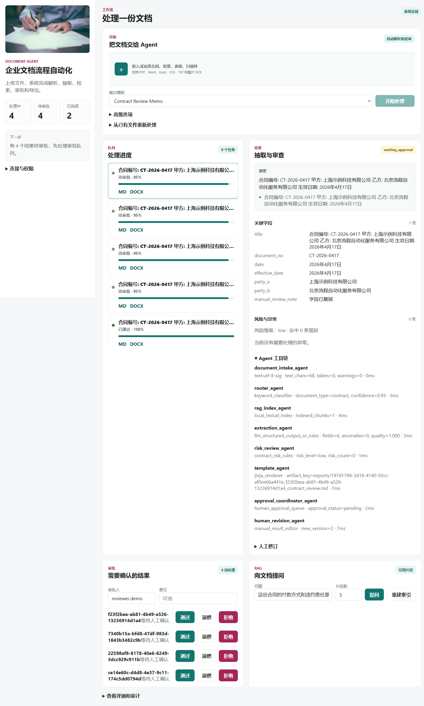

# 企业文档流程自动化 Agent 工作台

面向企业内部合同、发票和运行报告的 AI 工作流系统：把上传、解析、OCR、RAG、结构化抽取、风险检查、人工审批、审计和导出串成一条可观察的处理链路。

[](https://github.com/ZJUSCODE/enterprise-document-agent-workbench/actions/workflows/ci.yml)



## 两分钟看懂项目

1. 上传合同、发票或报告，系统记录文件元数据并创建处理任务。
2. Agent 依次完成解析、分类、RAG 索引、字段抽取、风险检查和模板生成。
3. 工作台展示每一步工具调用、耗时、字段、异常和引用片段。
4. 高风险结果进入人工审批；修订会生成新版本并写入审计日志。
5. 离线评测持续检查分类、字段抽取、证据检索和负查询拒答。

完整操作节奏见 [`docs/two-minute-demo.md`](docs/two-minute-demo.md)。当前未提供公网托管演示；本地演示不需要模型 Key，真实模型调用通过后端 OpenAI-compatible 接口完成。

## 可核验的证据

| 证据 | 说明 |
| --- | --- |
| [抽取评测报告](docs/evaluation_report.md) | 由隐私安全示例数据生成，包含分类、字段 Precision / Recall / F1 和逐案例明细 |
| [RAG 评测报告](docs/rag_evaluation_report.md) | 包含 Hit Rate@K、MRR、Evidence Recall、负查询拒答率和逐问题检索片段 |
| [多格式解析测试](tests/test_multiformat_parsing.py) | 在 CI 中生成并解析隐私安全的 PDF、DOCX、XLSX 和图片 OCR 样本 |
| [GitHub Actions](https://github.com/ZJUSCODE/enterprise-document-agent-workbench/actions/workflows/ci.yml) | 自动执行 Python 测试、两套离线评测、Vue 构建、本机 Chrome 页面验收和 Docker 全栈验收 |
| [工作流端到端测试](tests/test_workflow_e2e.py) | 覆盖上传、处理、审批、版本、RAG 和 Markdown / DOCX / PDF 导出 |

公开评测使用明确标注的隐私安全示例数据，不代表生产客户数据。报告中的案例数和指标均由评测脚本生成，README 不另行维护一套数字。

## 求职展示亮点

这个项目适合用来展示 AI 应用工程、Agent 工作流和企业级后台产品能力，重点可以讲：

- 端到端 Agent 闭环：从文件上传、解析、OCR、RAG 索引、结构化抽取、风险审查到审批和导出，不只是单点 LLM demo。
- 可观测工作流：前端展示任务进度、Agent 工具链、抽取字段、风险异常、审批队列、审计日志和质量指标。
- 工程化兜底：未配置模型 key 时使用规则抽取兜底，保证本地和面试现场可稳定演示。
- OpenAI-compatible 接入：后端统一模型调用入口，支持 SiliconFlow、DeepSeek、OpenAI-compatible endpoint，并使用 JSON Schema/JSON Object 约束结构化输出。
- 生产化扩展点：Celery 异步任务、Redis、PostgreSQL、MinIO、鉴权开关、RAG 重建、评测脚本和自动化测试都有清晰边界。

求职包装和面试讲法见：`docs/job-readiness.md`。
项目学习和代码讲解路线见：`docs/project-walkthrough.md`。
更完整的作品集讲解见：`docs/portfolio-case-study.md`。

## 能力范围

- 文件输入：PDF、Word、Excel、CSV、TXT、图片上传，记录文件元数据、校验值和存储键。
- 文档解析：按文件类型调用解析器，抽取正文、表格、页数/工作表数等元数据。
- OCR：支持图片 OCR 和扫描版 PDF 兜底 OCR。
- RAG：处理任务时自动建立本地文档 chunks，支持知识检索和引用片段回答。
- 字段抽取：支持 OpenAI-compatible API 结构化输出；未配置模型时使用规则抽取兜底。
- Agent 工作流：任务创建、路由、解析、RAG 索引、分类、抽取、风险审查、模板生成、失败重试、人工兜底。
- 异步任务：Celery + Redis 生产模式，本地开发可用 inline 队列；支持进度轮询和 SSE。
- 批处理：一次为多个文件创建任务。
- 审批审计：待审批队列、审批意见、操作日志、结果版本记录。
- 导出结果：根据模板生成 Markdown、DOCX、PDF、TXT 产物。
- 评测：任务成功率、人工接管率、抽取准确率代理、平均处理时长、异常分布。

## 项目结构

```text
backend/
  app/
    api/          FastAPI 路由
    models/       SQLAlchemy 模型
    schemas/      Pydantic Schema
    services/     解析、抽取、模板、工作流、评测、存储
    workers/      Celery worker
  alembic/        数据库迁移
frontend/
  src/
    components/   Vue 工作台组件
    api/          前端 API 客户端
samples/          演示文档
scripts/          Demo 和评测脚本
tests/            后端测试
```

## Docker Compose 运行

```powershell
docker compose up --build
```

默认会读取 `.env.example`；需要配置真实模型密钥或外部服务地址时，复制为 `.env` 后覆盖对应变量即可。

访问：

- 前端工作台：http://localhost:4173
- 后端 API：http://localhost:8000/docs
- MinIO 控制台：http://localhost:9001

创建演示任务：

```powershell
python scripts/seed_demo.py
python scripts/evaluate.py
python scripts/evaluate_dataset.py --labels samples/eval_labels.json --report-output docs/evaluation_report.md
python scripts/evaluate_rag.py --labels samples/rag_eval_labels.json --report-output docs/rag_evaluation_report.md
```

## 本地开发

从仓库根目录运行测试：

```powershell
python -m pytest tests
python scripts/evaluate_dataset.py --labels samples/eval_labels.json --report-output docs/evaluation_report.md
python scripts/evaluate_rag.py --labels samples/rag_eval_labels.json --report-output docs/rag_evaluation_report.md
```

项目包含 GitHub Actions 配置：`.github/workflows/ci.yml`，会执行后端测试、两套离线评测、前端生产构建、本机 Chrome 页面验收，以及 Docker 全栈和浏览器跨域链路验收。

后端：

```powershell
cd backend
python -m venv .venv
.\.venv\Scripts\Activate.ps1
pip install -r requirements.txt
$env:QUEUE_BACKEND="inline"
$env:STORAGE_BACKEND="local"
uvicorn app.main:app --reload --port 8000
```

前端：

```powershell
cd frontend
npm install
npm run dev
```

本地开发时前端默认通过 Vite 代理访问 `/api`，指向 `http://127.0.0.1:8000`。如果要直连其他后端地址，可以设置 `VITE_API_BASE_URL` 覆盖。

## OpenAI-compatible API

默认未配置模型 key 时，系统会使用规则抽取兜底，保证流程可演示。要接入模型，在 `.env` 中配置 provider 和对应 key。不要把 key 写入前端环境变量，所有模型请求都从后端发起。

SiliconFlow：

```text
AI_PROVIDER=siliconflow
SILICONFLOW_API_KEY=...
SILICONFLOW_BASE_URL=https://api.siliconflow.cn/v1
SILICONFLOW_MODEL=deepseek-ai/DeepSeek-V3.2
```

DeepSeek：

```text
AI_PROVIDER=deepseek
DEEPSEEK_API_KEY=...
DEEPSEEK_BASE_URL=https://api.deepseek.com
DEEPSEEK_MODEL=deepseek-chat
```

OpenAI-compatible custom endpoint：

```text
AI_PROVIDER=openai
OPENAI_API_KEY=...
OPENAI_BASE_URL=https://api.openai.com/v1
OPENAI_MODEL=gpt-4.1-mini
```

抽取服务位于 `backend/app/services/extractor.py`，优先使用 JSON Schema 约束输出；兼容 provider 不支持 `json_schema` 时会回退到 `json_object`。

## 可选鉴权

本地演示默认不开启鉴权。生产或答辩演示安全能力时，可以在 `.env` 中启用：

```text
API_AUTH_ENABLED=true
API_KEYS=demo-admin-key:admin.demo:admin|operator|reviewer|viewer,demo-reviewer-key:reviewer.demo:reviewer|viewer
```

前端侧边栏的 API Key 输入框会把 key 存在浏览器 `localStorage`，请求时自动带上 `X-API-Key`。真实部署时应改用登录态或网关注入的内部 token。

## 关键接口

- `POST /api/files/upload` 上传文件
- `POST /api/tasks` 创建单个任务
- `POST /api/tasks/batch` 批量创建任务
- `GET /api/tasks/{task_id}` 查看任务详情
- `GET /api/tasks/{task_id}/events/stream` SSE 任务事件，前端任务详情会实时刷新并保留轮询兜底
- `GET /api/tasks/{task_id}/export` 导出模板产物
- `POST /api/rag/query` 基于已处理文档检索回答
- `POST /api/rag/reindex` 重建本地 RAG 索引
- `GET /api/approvals?status=pending` 审批队列
- `POST /api/approvals/{approval_id}/decision` 审批决策
- `GET /api/audit` 审计日志
- `GET /api/metrics/evaluation` 评测指标

## 后续扩展点

- 将规则抽取升级为按文档类型的 Prompt/RAG 流水线。
- 将模板产物扩展为 DOCX、XLSX、PDF。
- 增加组织、用户、角色权限和 SSO。
- 将本地 RAG 检索替换为 pgvector 或外部向量库做跨文档 hybrid search。
- 增加标注集，计算真实字段级准确率、召回率和人工修正成本。
